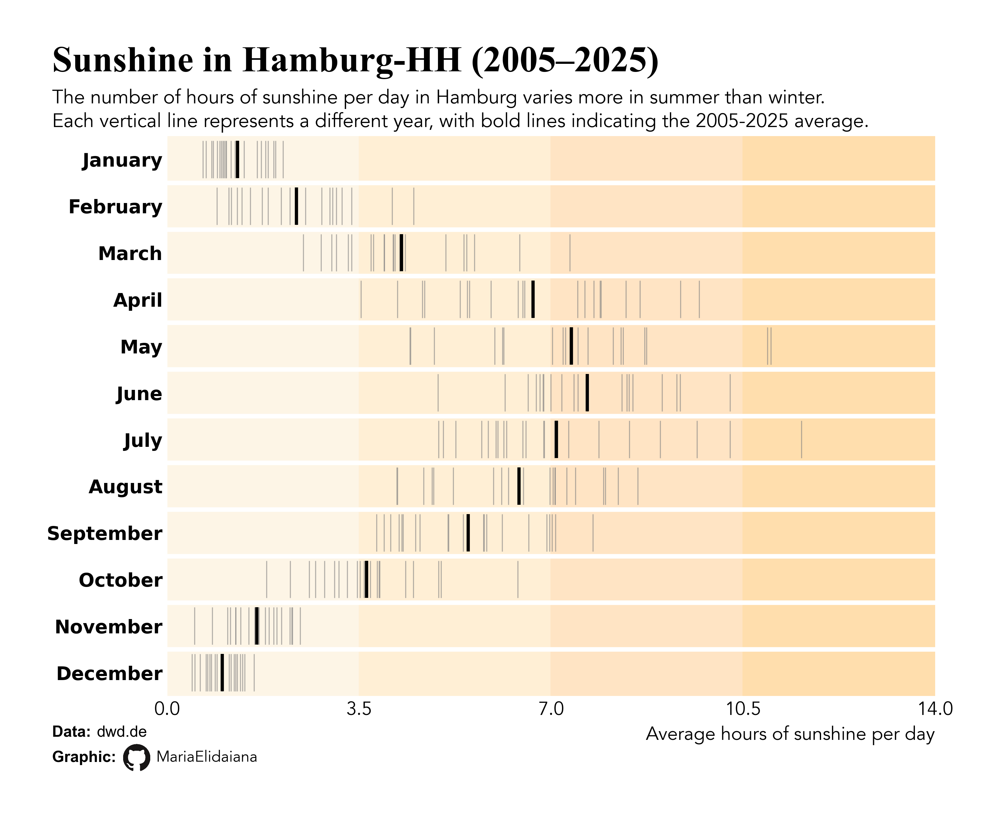

# What about the sunshine?

I miss the brazilian constancy of ~7 hours of sunshine per day, all year around:

I struggle with the german dark winter:

<small> Plot inspired by a bluesky post of [nrennie](https://bsky.app/profile/nrennie.bsky.social/post/3m3mucditmc2o).
